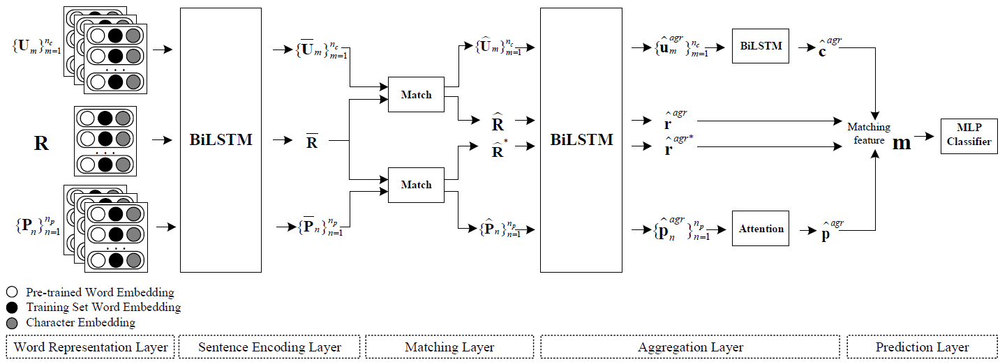

# Dually Interactive Matching Network for Personalized Response Selection in Retrieval-Based Chatbots
This repository contains the source code and dataset for the EMNLP 2019 paper [Dually Interactive Matching Network for Personalized Response Selection in Retrieval-Based Chatbots](https://www.aclweb.org/anthology/D19-1193.pdf) by Gu et al. <br>

Our proposed Dually Interactive Matching Network (DIM) has achieved a new state-of-the-art performance of response selection on the PERSONA-CHAT dataset.

## Model overview


## Results


## Dependencies
Python 2.7 <br>
Tensorflow 1.4.0

## Dataset
Your can download the PERSONA-CHAT dataset [here](https://drive.google.com/open?id=1gNyVL5pSMO6DnTIlA9ORNIrd2zm8f3QH) or from [ParlAI](https://parl.ai/), and unzip it to the folder of ```data```. <br>
Run the following commands and the processed files are stored in ```data/personachat_processed/```. <br>
```
cd data
python data_preprocess.py
```
Then, download the embedding and vocab files [here](https://drive.google.com/open?id=1gGZfQ-m7EGo5Z1Ts93Ta8GPJpdIQqckC), and unzip them to the folder of ```data/personachat_processed/```.

## Train a new model
```
cd scripts
bash train.sh
```
The training process is recorded in ```log_DIM_train.txt``` file.

## Test a trained model
```
bash test.sh
```
The testing process is recorded in ```log_DIM_test.txt``` file. And your can get a ```persona_test_out.txt``` file which records scores for each context-response pair. Run the following command and you can compute the metric of Recall.
```
python compute_recall.py
```

## Cite
If you use the code, please cite the following paper:
**"Dually Interactive Matching Network for Personalized Response Selection in Retrieval-Based Chatbots"**
Jia-Chen Gu, Zhen-Hua Ling, Xiaodan Zhu, Quan Liu. _EMNLP (2019)_

```
@inproceedings{gu-etal-2019-dually,
    title = "Dually Interactive Matching Network for Personalized Response Selection in Retrieval-Based Chatbots",
    author = "Gu, Jia-Chen  and
              Ling, Zhen-Hua  and
              Zhu, Xiaodan  and
              Liu, Quan",
    booktitle = "Proceedings of the 2019 Conference on Empirical Methods in Natural Language Processing and the 9th International Joint Conference on Natural Language Processing (EMNLP-IJCNLP)",
    month = nov,
    year = "2019",
    address = "Hong Kong, China",
    publisher = "Association for Computational Linguistics",
    url = "https://www.aclweb.org/anthology/D19-1193",
    pages = "1845--1854",
}
```
